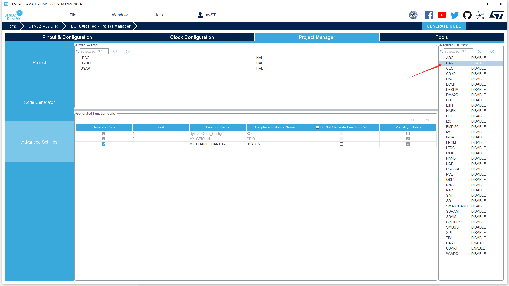

# 超级香的SEML库驱动层接口库

## 简介

为了解决不同项目间使用bsp层的耦合性问题，让SEML库适用于所有机器人项目，所以开发了这个驱动层接口库，bsp层可以使用统一的接口与mcu外设进行通讯，并且能够做到无需修改任何库里面任何内容即可完成不同项目甚至不同型号mcu之间的快速移植。

### 特点

- **低耦合性**：任何mcu只要对应的通讯接口一致都可以使用，如果不一致需要对其进行进一步封装使其接口一致也可以使用。(实在不行还有io口模拟兜底对吧)

- **易用性**：只需要在主函数初始化的时候对接口进行注册即可使用。

- **方便移植**：若添加其他模块驱动只需要小改其接口函数即可移植。

## I2C接口

### 使用方法

需要使用到的函数原型如下：

```c
typedef struct 
{
    void *hi2c;                     /**< i2c接口句柄 */
    I2C_Transmit_t I2C_Transmit;    /**< i2c发送函数 */
    I2C_Receive_t I2C_Receive;      /**< i2c接收函数 */
    I2C_Mem_Read_t I2C_Mem_Read;    /**< i2c读寄存器函数 */
    I2C_Mem_Write_t I2C_Mem_Write;  /**< i2c写寄存器函数 */
} I2C_Handle_t;

/**
 * @brief 硬件I2C注册函数
 * @param config 配置结构体指针
 * @param hi2c_ i2c接口句柄
 */
#ifdef USE_HAL_DRIVER
#define Hardware_I2C_Register(I2C_Handle,hi2c_) SEML_I2C_Register(I2C_Handle,hi2c_,\
                                        HAL_I2C_Master_Transmit,HAL_I2C_Master_Receive,\
                                        HAL_I2C_Mem_Write,HAL_I2C_Mem_Read)
#endif

/**
 * @brief 软件I2C注册函数
 * @param config 配置结构体指针
 * @param hi2c_ i2c接口句柄
 */
#define Software_I2C_Register(I2C_Handle,hi2c_) SEML_I2C_Register(I2C_Handle,hi2c_,\
                                        Software_I2C_Transmit,Software_I2C_Receive,\
                                        Software_I2C_Mem_Write,Software_I2C_Mem_Read)
```

如果使用hal库的硬件i2c，直接调用`Hardware_I2C_Register`进行初始化即可，在seml库中，各个驱动句柄内皆有接口句柄：

```c
// 初始化硬件i2c接口
Hardware_I2C_Register(&ist8310.I2C_Handle, &hi2c1);
SEML_GPIO_Pin_Register(&ist8310.RSTN_Pin, RSTN_IST8310_GPIO_Port, RSTN_IST8310_Pin);
if (ist8310_init(&ist8310) == 0)
	AHRS_Init(&ahrs, 0.001f, Madgwick_AHRS_Update, BMI088_Read, &bmi088, ist8310_read_mag, &ist8310);
else
	AHRS_Init(&ahrs, 0.001f, Madgwick_AHRS_Update, BMI088_Read, &bmi088, NULL, NULL);
```

如果使用软件i2c，需要先对软件i2c进行初始化：

```c
// 初始化软件i2c
Software_I2C_HandleTypeDef oled_i2c;
Software_I2C_Init(&oled_i2c, OLED_SDA_GPIO_Port, OLED_SDA_Pin, OLED_SCL_GPIO_Port, OLED_SCL_Pin);
// 初始化u8g2
u8g2_sw_i2c_init(&oled, &oled_i2c, u8g2_Setup_ssd1306_i2c_128x64_noname_f);
/**
 * @brief 初始化使用软件i2c的u8g2
#define u8g2_sw_i2c_init(u8g2_handle, hi2c, u8g2_setup)                                \
	do                                                                                   \
	{                                                                                    \
		Software_I2C_Register(&(u8g2_handle)->u8x8.I2C_Handle, (hi2c));                   \
		u8g2_setup(u8g2_handle, U8G2_R0, u8x8_byte_seml_i2c, u8g2_gpio_and_delay_seml); \
		u8g2_InitDisplay(u8g2_handle);                                                     \
		u8g2_SetPowerSave(u8g2_handle, 0);                                                 \
		u8g2_ClearDisplay(u8g2_handle);                                                    \
		u8g2_ClearBuffer(u8g2_handle);                                                     \
	} while (0)
*/
```

### 移植方法

以I2C为例，在当前模块的句柄中加入`I2C_Handle_t I2C_Handle`，如ist8310：

```c
typedef struct
{
  uint8_t status;
  float mag[3];
#ifdef USE_SEML_LIB
  I2C_Handle_t I2C_Handle;
#endif
} ist8310_Handle_t;
```

通常为了便于从库中剥离出来，在bsp层使用SEML库的内容时候会加入：`#ifdef USE_SEML_LIB`

随后将修改其读写接口：

```c
/**
  * @brief          通过读取磁场数据
  * @param[out]     ist8310_handle ist8310的数据结构
  * @retval         none
  */
void ist8310_read_mag(ist8310_Handle_t *ist8310_handle)
{
  uint8_t buf[6];
  int16_t temp_ist8310_data = 0;
  // read the "DATAXL" register (0x03)
#ifdef USE_SEML_LIB
  SEML_I2C_Mem_Read(&ist8310_handle->I2C_Handle,IST8310_IIC_ADDRESS << 1, 0x03,I2C_MEMADD_SIZE_8BIT,buf,6,10);
#else
  ist8310_IIC_read_muli_reg(0x03, buf, 6);
#endif
  temp_ist8310_data = (int16_t)((buf[1] << 8) | buf[0]);
  ist8310_handle->mag[0] = MAG_SEN * temp_ist8310_data;
  temp_ist8310_data = (int16_t)((buf[3] << 8) | buf[2]);
  ist8310_handle->mag[1] = MAG_SEN * temp_ist8310_data;
  temp_ist8310_data = (int16_t)((buf[5] << 8) | buf[4]);
  ist8310_handle->mag[2] = MAG_SEN * temp_ist8310_data;
}
```

即完成移植。若相对复杂的没法添加句柄的驱动层函数，可以直接定义一个全局变量，通过初始化该全局变量来使用。

## SPI接口

### 使用方法

需要使用到的函数原型如下：

```c
typedef struct 
{
    void *hspi;                                     /**< spi接口句柄 */
    SPI_Transmit_t SPI_Transmit;                    /**< spi发送函数 */
    SPI_Receive_t SPI_Receive;                      /**< spi接收函数 */
    SPI_TransmitReceive_t SPI_TransmitReceive;      /**< spi发送接收函数 */
} SPI_Handle_t;

/**
 * @brief 硬件SPI注册函数
 * @param config 配置结构体指针
 * @param hi2c_ SPI接口句柄
 */
#ifdef USE_HAL_DRIVER
#define Hardware_SPI_Register(SPI_Handle,hspi_) SEML_SPI_Register(SPI_Handle,hspi_,\
                                        HAL_SPI_Transmit,HAL_SPI_Receive,\
                                        HAL_SPI_TransmitReceive)
#endif
```

如果使用hal库的硬件spi，直接调用`Hardware_SPI_Register`进行初始化即可，在seml库中，各个驱动句柄内皆有接口句柄：

```c
SEML_GPIO_Pin_Register(&BMI088.CS1_Accel_handle,CS1_ACCEL_GPIO_Port,CS1_ACCEL_Pin);
SEML_GPIO_Pin_Register(&BMI088.CS1_Gyro_handle,CS1_GYRO_GPIO_Port,CS1_GYRO_Pin);
Hardware_SPI_Register(&BMI088.SPI_Handle,&hspi1);
while(BMI088_Init(&BMI088));
```

## CAN接口

can接口是基于消息列表的一个封装形式，将各个id接收后回调各自的回调函数。是电机库必不可缺的接口。

### 使用方法

使用前需要使能can的接收中断，开启can的注册回调：



需要使用到的函数原型如下：

```c
typedef struct 
{
	CAN_IF_t *hcan;
	message_List_t Rxmessage_list;
	CAN_TxHeaderTypeDef Txmessage_Buffer[CAN_BUFFER_SIZE];
	uint16_t Txmessage_front;
	uint16_t Txmessage_rear;
	void *next;
} Can_Handle_t;
/**
 * @brief can初始化函数
 * 
 * @param can_handle can句柄
 * @param hcan 底层can配置句柄
 * @param id_buffer id缓存数组指针
 * @param size 缓存数组大小
 */
void SEML_CAN_Init(Can_Handle_t *can_handle,void *hcan, message_Pack_t *id_buffer, uint16_t size);

/**
 * @brief can接收回调函数
 * @param hcan 底层can配置句柄
 */
void SEML_CAN_RxCallback(CAN_IF_t *hcan);
```

与其他驱动不同的是，由于can的注册回调必须在初始化前进行注册，所以使用注册回调必须先注册回调后初始化can：

```c
message_Pack_t can1_rx_buffer[10];
Can_Handle_t can1;
// 初始化SEML库的can接口
SEML_CAN_Init(&can1,&hcan1,can1_rx_buffer,10);
// 注册can接收回调函数
HAL_CAN_RegisterCallback(&hcan1,HAL_CAN_RX_FIFO0_MSG_PENDING_CB_ID,SEML_CAN_RxCallback);
// 初始化stm32的can
CAN_FilterTypeDef sFilterConfig;

sFilterConfig.FilterBank = 0; // 设置过滤器组编号
sFilterConfig.SlaveStartFilterBank = 0;
sFilterConfig.FilterMode = CAN_FILTERMODE_IDMASK; // 掩码模式
sFilterConfig.FilterMaskIdHigh = 0x00 << 5;		  // 掩码符寄存器ID高十六位
sFilterConfig.FilterMaskIdLow = 0x00 << 5;		  // 掩码符寄存器ID低十六位
sFilterConfig.FilterIdHigh = 0x00 << 5;			  // 标识符寄存器ID高十六位
sFilterConfig.FilterIdLow = 0x00 << 5;			  // 标识符寄存器ID低十六位
sFilterConfig.FilterScale = CAN_FILTERSCALE_16BIT; // 16位宽
sFilterConfig.FilterFIFOAssignment = CAN_RX_FIFO0; // 过滤器组关联到FIFO0
sFilterConfig.FilterActivation = ENABLE;		   // 激活过滤器
// 配置过滤器
if (HAL_CAN_ConfigFilter(&hcan1, &sFilterConfig) != HAL_OK)
	Error_Handler();
// 启动CAN
if (HAL_CAN_Start(&hcan1) != HAL_OK)
	Error_Handler();
// 启动CAN的FIFO0接收中断
if (HAL_CAN_ActivateNotification(&hcan1, CAN_IT_RX_FIFO0_MSG_PENDING) != HAL_OK)
	Error_Handler();
```

## PWM接口

SEML库中，使用PWM的接口有蜂鸣器"Buzzer.h"。

### 使用方法

需要使用到的函数原型如下：

```c
typedef struct 
{
	PWM_IF_t* timer_handle;
	uint32_t channel;
	uint32_t timer_clock_frec;
}PWM_Handle_t;
/**
 * @brief PWM初始化
 * @param pwm_handle PWM句柄
 * @param htim 定时器句柄 
 * @param channel 通道
 * @param timer_clock_frec 定时器时钟频率
 */
void PWM_Init(PWM_Handle_t *pwm_handle,PWM_IF_t *htim,uint32_t channel,uint32_t timer_clock_frec);
/**
 * 
 * @brief 设置PWM频率
 * @param pwm_handle PWM句柄
 * @param frec 设置频率
 */
void PWM_Set_Frec(PWM_Handle_t *pwm_handle,uint32_t frec);
/**
 * @brief 设置PWM占空比
 * @param pwm_handle PWM句柄
 * @param duty 占空比(0-1)
 */
void PWM_Set_Duty(PWM_Handle_t *pwm_handle,float duty);
```

PWM接口可以根据tim的定时器时钟频率（定时器的输入频率，tim1和tim8为APB2定时器频率,其他为APB1定时器频率）自动调整，需要提前配置好ARR寄存器：

```c
// 初始化PWM
PWM_Handle_t buzzer_pwm;
PWM_Init(&buzzer_pwm,&htim4,TIM_CHANNEL_3,84000000);
// 设置pwm频率
PWM_Set_Frec(&buzzer_pwm,50);
// 设置PWM占空比
PWM_Set_Duty(&buzzer_pwm,0.5f);
```

## GPIO接口

### 使用方法

需要使用到的函数原型如下：

```c
/**
 * @brief GPIO句柄
 */
typedef struct
{
	GPIO_IF_t *GPIO_Part; /**< GPIO端口 */
	uint16_t GPIO_Pin;			 /**< GPIO引脚 */
} GPIO_Handle_t;
/**
 * @brief 注册GPIO引脚
 * @param GPIO_PART GPIO端口
 * @param GPIO_PIN  GPIO引脚
 */
#define SEML_GPIO_Pin_Register(GPIO_Handle, GPIO_PART, GPIO_PIN);
/**
 * @brief GPIO引脚输出置1
 * @param GPIO_Handle GPIO句柄
 */
void SEML_GPIO_Pin_Set(GPIO_Handle_t *GPIO_Handle);
/**
 * @brief GPIO引脚输出置0
 * @param GPIO_Handle GPIO句柄
 */
void SEML_GPIO_Pin_Reset(GPIO_Handle_t *GPIO_Handle);
/**
 * @brief GPIO引脚输出
 * @param GPIO_Handle GPIO句柄
 * @param status 输出状态
 */
void SEML_GPIO_Pin_Output(GPIO_Handle_t *GPIO_Handle, uint16_t status);
/**
 * @brief GPIO引脚输出反转
 * @param GPIO_Handle GPIO句柄
 */
void SEML_GPIO_Pin_Toggle(GPIO_Handle_t *GPIO_Handle);
/**
 * @brief GPIO引脚输入
 * @param GPIO_Handle GPIO句柄
 */
uint16_t SEML_GPIO_Pin_Input(GPIO_Handle_t *GPIO_Handle);
```

初始化方法如下：

```c
// 初始化gpio
SEML_GPIO_Pin_Register(&BMI088.CS1_Accel_handle,CS1_ACCEL_GPIO_Port,CS1_ACCEL_Pin);
```

## UART接口

UART接口相对于其他接口来说配置较为复杂，需要仔细阅读。

### 使用方法

需要使用到的函数原型如下：

```c
typedef struct
{
  UART_IF_t *huart;     /**< 串口接口句柄 */
  GPIO_Handle_t tx_en_gpio; /**< 发送使能io */
  enum
  {
    UART_Type_TTL = 0,                  /**< TTL模式 */
    UART_Type_RS485,                    /**< 485模式 */
  } type : 4;                           /**< 串口模式 */
  UART_Transmission_Mode_t tx_mode : 2; /**< 发送模式 */
  UART_Transmission_Mode_t rx_mode : 2; /**< 接收模式 */
  uint8_t *rx_buffer;                   /**< 接收缓存 */
  uint16_t rx_buffer_length;            /**< 接收缓存长度 */
  void (*rx_callback_fun)(void *uart);  /**< 接收回调函数 */
  void *rx_callback_config;             /**< 接收回调函数配置 */
  uint32_t timeout;                     /**< 超时时间(阻塞模式使用) */
  void *next;
} UART_Handle_t;

/**
 * @brief 串口初始化
 * @param uart 串口句柄
 * @param tx_mode 发送模式
 * @param rx_mode 接收模式
 * @param timeout 超时时间
 * @param huart 串口接口句柄
 */
void SEML_UART_Init(UART_Handle_t *uart, UART_Transmission_Mode_t tx_mode, UART_Transmission_Mode_t rx_mode, uint32_t timeout, UART_IF_t *huart);

/**
 * @brief 485模式串口初始化
 * @param uart 串口句柄
 * @param tx_mode 发送模式
 * @param rx_mode 接收模式
 * @param timeout 超时时间
 * @param huart 串口接口句柄
 * @param tx_en_part 发送使能端口
 * @param tx_en_pin 发送使能引脚
 */
void SEML_RS_485_Init(UART_Handle_t *uart, UART_Transmission_Mode_t tx_mode, UART_Transmission_Mode_t rx_mode, uint32_t timeout, UART_IF_t *huart, GPIO_IF_t *tx_en_part, uint16_t tx_en_pin);

/**
 * @brief 串口发送函数
 * @param uart 串口句柄
 * @param data 数据指针
 * @param length 数据长度
 * @return 函数运行状态
 */
SEML_StatusTypeDef SEML_UART_Transmit(UART_Handle_t *uart, uint8_t *data, uint8_t length);

/**
 * @brief 串口接收函数
 * @param uart 串口句柄
 * @param data 数据指针
 * @param length 数据长度
 * @return 函数运行状态
 */
SEML_StatusTypeDef SEML_UART_Receive(UART_Handle_t *uart, uint8_t *data, uint16_t length);

/**
 * @brief 注册串口接收回调函数
 * @param uart 串口句柄
 * @param rx_callback_fun 接收回调函数
 * @param rx_callback_config 接收回调函数配置
 */
void SEML_UART_Register_Callback(UART_Handle_t *uart, Rx_Callback_t rx_callback_fun, void *rx_callback_config);

/**
 * @brief 串口接收完成中断回调函数
 * @param config 串口接口句柄
 */
void SEML_UART_Rx_Complete_Callback(void *config);
```

相比hal库，SEML库的uart将接收和发送模式在初始化阶段进行了配置，使用的时候只需要调用`SEML_UART_Transmit`和`SEML_UART_Receive`即可。

uart的传输模式如下:

```c
typedef enum
{
  UART_Block_Mode,     /**< 阻塞 */
  UART_DMA_Mode,       /**< DMA */
  UART_IT_Mode,        /**< 中断 */
  UART_DMA_Cycle_Mode, /**< DMA循环 */
  UART_IT_Cycle_Mode   /**< 中断循环 */
} UART_Transmission_Mode_t;
```

其中，接收可以使用全部的模式，但是**需要注意先对hal进行配置**(波特率、DMA、中断需配置好)。

发送只能使用阻塞和中断，使用其他模式会被断言。

如果是TTL电平，初始化方法如下：

```c
// uart初始化 发送:中断模式 接收:DMA循环接收模式 阻塞等待10s(在这里没用) 绑定到huart1
SEML_UART_Init(&uart, UART_IT_Mode, UART_DMA_Cycle_Mode, 10, &huart1);
// 注册串口接收完成回调函数
HAL_UART_RegisterCallback(&huart1, HAL_UART_RX_COMPLETE_CB_ID, SEML_UART_Rx_Complete_Callback);
```