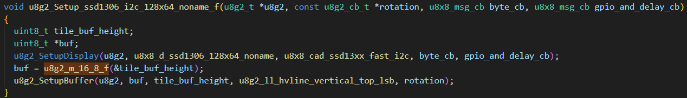
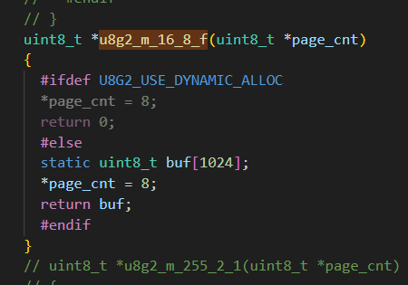

# u8g2库使用说明
## 常用函数
### 基本函数
```c
u8g2_t u8g2;		// 显示器初始化结构体
u8g2_Setup_ssd1306_i2c_128x64_noname_f(&u8g2, U8G2_R0, u8x8_byte_stm32_hal_hw_i2c, u8g2_gpio_and_delay_stm32_hal);
u8g2_InitDisplay(&u8g2);     // 发送init序列到显示器，显示器在此之后处于睡眠模式
u8g2_SetPowerSave(&u8g2, 0); // 唤醒显示器
u8g2_ClearDisplay(&u8g2);    // 清除屏幕缓冲区
u8g2_ClearBuffer(&u8g2);      // 清除u8g2显示缓冲区
u8g2_SetFont(&u8g2, u8g2_font_wqy12_t_gb2312a);	// 设置字库为u8g2_font_wqy12_t_gb2312a(字库全，但是110KB..12为字体大小)
												// 也可以设置成其他的，在u8g.h中找
u8g2_DrawUTF8(&u8g2, 0, 12, "你好，世界！");		// 输出字符
u8g2_SendBuffer(u8g2);       // 发送显示数据
```
### 绘制相关函数
绘制圆
```c
/**
 * 画空心圆，圆心坐标为(x0,y0),半径为rad
 * @param x0 圆点的x坐标
 * @param y0 圆点的y坐标
 * @param rad 圆形的半径
 * @param opt 圆形选项
 *        U8G2_DRAW_ALL 整个圆
 *        U8G2_DRAW_UPPER_RIGHT 右上部分的圆弧
 *        U8G2_DRAW_UPPER_LEFT  左上部分的圆弧
 *        U8G2_DRAW_LOWER_LEFT  左下部分的圆弧
 *        U8G2_DRAW_LOWER_RIGHT 右下部分的圆弧
 *        选项可以通过 | 操作符来组合
 */
void u8g2_DrawCircle(u8g2_t *u8g2, u8g2_uint_t x0, u8g2_uint_t y0, u8g2_uint_t rad, uint8_t option);
/**
 * 画实心圆，圆心坐标为(x0,y0),半径为rad
 * @param x0 圆点的x坐标
 * @param y0 圆点的y坐标
 * @param rad 圆形的半径
 * @param opt 圆形选项
 *        U8G2_DRAW_ALL 整个圆
 *        U8G2_DRAW_UPPER_RIGHT 右上部分的圆弧
 *        U8G2_DRAW_UPPER_LEFT  左上部分的圆弧
 *        U8G2_DRAW_LOWER_LEFT  左下部分的圆弧
 *        U8G2_DRAW_LOWER_RIGHT 右下部分的圆弧
 *       选项可以通过 | 操作符来组合
 */
void u8g2_DrawDisc(u8g2_t *u8g2, u8g2_uint_t x0, u8g2_uint_t y0, u8g2_uint_t rad, uint8_t option);
/**
 * 画空心椭圆，圆心坐标为(x0,y0),半径为rad
 * @param x0 圆点的x坐标
 * @param y0 圆点的y坐标
 * @param rx 椭圆形水平x方向的半径
 * @param ry 椭圆形竖直y方向的半径
 * @param opt 圆形选项
 *        U8G2_DRAW_ALL 整个椭圆
 *        U8G2_DRAW_UPPER_RIGHT 右上部分的圆弧
 *        U8G2_DRAW_UPPER_LEFT  左上部分的圆弧
 *        U8G2_DRAW_LOWER_LEFT  左下部分的圆弧
 *        U8G2_DRAW_LOWER_RIGHT 右下部分的圆弧
 *        选项可以通过 | 操作符来组合
 */
void u8g2_DrawEllipse(u8g2_t *u8g2, u8g2_uint_t x0, u8g2_uint_t y0, u8g2_uint_t rx, u8g2_uint_t ry, uint8_t option);
/**
 * 画实心椭圆，圆心坐标为(x0,y0),半径为rad
 * @param x0 圆点的x坐标
 * @param y0 圆点的y坐标
 * @param rx 椭圆形水平x方向的半径
 * @param ry 椭圆形竖直y方向的半径
 * @param opt 圆形选项
 *        U8G2_DRAW_ALL 整个椭圆
 *        U8G2_DRAW_UPPER_RIGHT 右上部分的圆弧
 *        U8G2_DRAW_UPPER_LEFT  左上部分的圆弧
 *        U8G2_DRAW_LOWER_LEFT  左下部分的圆弧
 *        U8G2_DRAW_LOWER_RIGHT 右下部分的圆弧
 *        选项可以通过 | 操作符来组合
 */
void u8g2_DrawFilledEllipse(u8g2_t *u8g2, u8g2_uint_t x0, u8g2_uint_t y0, u8g2_uint_t rx, u8g2_uint_t ry, uint8_t option);
```
绘制多边形
```c
/**
 * 画实心矩形，左上角坐标为(x,y),宽度为w，高度为h
 * @param x 左上角的x坐标
 * @param y 左上角的y坐标
 * @param w 方形的宽度
 * @param h 方形的高度
 */
void u8g2_DrawBox(u8g2_t *u8g2, u8g2_uint_t x, u8g2_uint_t y, u8g2_uint_t w, u8g2_uint_t h);
/**
 * 画空心方形，左上角坐标为(x,y),宽度为w，高度为h
 * @param x 左上角的x坐标
 * @param y 左上角的y坐标
 * @param w 方形的宽度
 * @param h 方形的高度
 */
void u8g2_DrawFrame(u8g2_t *u8g2, u8g2_uint_t x, u8g2_uint_t y, u8g2_uint_t w, u8g2_uint_t h);
/**
 * 绘制圆角实心方形，左上角坐标为(x,y),宽度为w，高度为h，圆角半径为r
 * @param x 左上角的x坐标
 * @param y 左上角的y坐标
 * @param w 方形的宽度
 * @param h 方形的高度
 * @param r 圆角半径
 */
void u8g2_DrawRBox(u8g2_t *u8g2, u8g2_uint_t x, u8g2_uint_t y, u8g2_uint_t w, u8g2_uint_t h, u8g2_uint_t r);
/**
 * 绘制圆角空心方形，左上角坐标为(x,y),宽度为w，高度为h，圆角半径为r
 * @param x 左上角的x坐标
 * @param y 左上角的y坐标
 * @param w 方形的宽度
 * @param h 方形的高度
 * @param r 圆角半径
 */
void u8g2_DrawRFrame(u8g2_t *u8g2, u8g2_uint_t x, u8g2_uint_t y, u8g2_uint_t w, u8g2_uint_t h, u8g2_uint_t r);
/// @brief 绘制实心三角形，定点坐标分别为(x0,y0),(x1,y1),(x2,y2)
/// @param x0 顶点0的x坐标
/// @param y0 顶点0的y坐标
/// @param x1 顶点1的x坐标
/// @param y1 顶点1的y坐标
/// @param x2 顶点2的x坐标
/// @param y2 顶点2的y坐标
void u8g2_DrawTriangle(u8g2_t *u8g2, int16_t x0, int16_t y0, int16_t x1, int16_t y1, int16_t x2, int16_t y2);
```
绘制线
```c
/**
 * 绘制线，从坐标(x1,y1) 到(x2,y2)
 * @param x1 端点0的x坐标
 * @param y1 端点0的y坐标
 * @param x2 端点1的x坐标
 * @param y2 端点1的y坐标
 */
void u8g2_DrawLine(u8g2_t *u8g2, u8g2_uint_t x1, u8g2_uint_t y1, u8g2_uint_t x2, u8g2_uint_t y2);
/**
 * 绘制水平线
 * @param x 左上角的x坐标
 * @param y 左上角的y坐标
 * @param len 水平线的长度
 */
void u8g2_DrawHLine(u8g2_t *u8g2, u8g2_uint_t x, u8g2_uint_t y, u8g2_uint_t len);
/**
 * 绘制垂直线
 * @param x 左上角的x坐标
 * @param y 左上角的y坐标
 * @param len 水平线的长度
 */
void u8g2_DrawVLine(u8g2_t *u8g2, u8g2_uint_t x, u8g2_uint_t y, u8g2_uint_t len);
/**
 * 绘制像素点，坐标(x,y)
 * @param x 像素点的x坐标
 * @param y 像素点的y坐标
 * @Note 关联方法 setDrawColor
 */
void u8g2_DrawPixel(u8g2_t *u8g2, u8g2_uint_t x, u8g2_uint_t y);
```
绘制文字
```c
/**
 * 绘制UTF8编码的字符串
 * @param x 字符串在屏幕上的左下角x坐标
 * @param y 字符串在屏幕上的左下角y坐标
 * @param s 需要绘制的UTF-8编码字符串
 * @return 返回字符串的长度
 */
u8g2_uint_t u8g2_DrawUTF8(u8g2_t *u8g2, u8g2_uint_t x, u8g2_uint_t y, const char *str);
/**
 * 绘制字体字集里面定义的符号
 * @param x 左上角的x坐标
 * @param y 左上角的y坐标
 * @param encoding 字符的unicode值
 * @Note 关联方法 u8g2_SetFont
 */
u8g2_uint_t u8g2_DrawGlyph(u8g2_t *u8g2, u8g2_uint_t x, u8g2_uint_t y, uint16_t encoding);
```
## 关于移植
### 文件配置
u8g2里面支持多种驱动芯片，以u8x8_d_xxx.c命名的就是驱动文件，我们使用的是0.96寸oled，芯片是ssd1306，因此只需将u8x8_d_ssd1312_128x64_noname.c这个驱动文件添加到工程中。<br>


修改"u8g2_d_setup.c"这个文件，里面有各种驱动芯片的初始化函数，注释其他函数，只留下与使用的驱动芯片相关的函数。<br>
我们常使用的0.96寸OLED是ssd1306，但是与ssd1306相关的有多个函数，例如：<br>
spi接口：<br>
```c
u8g2_Setup_ssd1306_128x64_noname_1(u8g2_t *u8g2, const u8g2_cb_t *rotation, u8x8_msg_cb byte_cb, u8x8_msg_cb gpio_and_delay_cb);
u8g2_Setup_ssd1306_128x64_noname_2(u8g2_t *u8g2, const u8g2_cb_t *rotation, u8x8_msg_cb byte_cb, u8x8_msg_cb gpio_and_delay_cb);
u8g2_Setup_ssd1306_128x64_noname_f(u8g2_t *u8g2, const u8g2_cb_t *rotation, u8x8_msg_cb byte_cb, u8x8_msg_cb gpio_and_delay_cb);
```
i2c接口：<br>
```c
u8g2_Setup_ssd1306_i2c_128x64_noname_1(u8g2_t *u8g2, const u8g2_cb_t *rotation, u8x8_msg_cb byte_cb, u8x8_msg_cb gpio_and_delay_cb);
u8g2_Setup_ssd1306_i2c_128x64_noname_2(u8g2_t *u8g2, const u8g2_cb_t *rotation, u8x8_msg_cb byte_cb, u8x8_msg_cb gpio_and_delay_cb);
u8g2_Setup_ssd1306_i2c_128x64_noname_f(u8g2_t *u8g2, const u8g2_cb_t *rotation, u8x8_msg_cb byte_cb, u8x8_msg_cb gpio_and_delay_cb);
```
后缀1、2、f代表缓冲区大小的不同：1代表128字节，2代表256字节，f代表1024字节；根据单片机空间的大小选择合适的接口，缓冲区小的，刷新lcd/oled的时候就比较耗时，反之亦然。<br>
我们用到的是:`u8g2_Setup_ssd1306_i2c_128x64_noname_f`注释掉其他函数。<br>


根据上图发现缓冲区调用了u8g2_m_16_8_f这条函数，修改“u8g2_d_memory.c”文件，屏蔽掉没用到的，留下用到的：<br>


`u8g2_fonts.c`文件中定义了各种字库，这些字库比较占用空间，根据使用情况屏蔽掉没有使用的。
### 接口函数
u8g2初始化的时候调用的是这条函数，他有两个回调函数，第一个是byte_cb是通信相关的函数，比如i2c写数据。第二个是gpio_and_delay_cb是延时和io口相关的函数。
官方也有具体给例：https://github.com/olikraus/u8g2/wiki/Porting-to-new-MCU-platform
```c
typedef uint8_t (*u8x8_msg_cb)(u8x8_t *u8x8, uint8_t msg, uint8_t arg_int, void *arg_ptr);
typedef uint16_t (*u8x8_char_cb)(u8x8_t *u8x8, uint8_t b);
void u8g2_Setup_ssd1306_i2c_128x64_noname_f(u8g2_t *u8g2, const u8g2_cb_t *rotation, u8x8_msg_cb byte_cb, u8x8_msg_cb gpio_and_delay_cb)
```
通信函数分为硬件接口和软件模拟方式，软件模拟方式官方基本写好了，只需要简单的指定io口即可。<br>
软件i2c：<br>
通信函数：直接使用官方的这个u8x8_byte_sw_i2c。<br>
```c
// 位于u8x8_byte.c
uint8_t u8x8_byte_sw_i2c(u8x8_t *u8x8, uint8_t msg, uint8_t arg_int, void *arg_ptr)
{
  uint8_t *data;
  switch(msg)
  {
    case U8X8_MSG_BYTE_SEND:
      data = (uint8_t *)arg_ptr;
      while( arg_int > 0 )
      {
	i2c_write_byte(u8x8, *data);
	data++;
	arg_int--;
      }
      break;
    case U8X8_MSG_BYTE_INIT:
      i2c_init(u8x8);
      break;
    case U8X8_MSG_BYTE_SET_DC:
      break;
    case U8X8_MSG_BYTE_START_TRANSFER:
      i2c_start(u8x8);
      i2c_write_byte(u8x8, u8x8_GetI2CAddress(u8x8));
      //i2c_write_byte(u8x8, 0x078);
      break;
    case U8X8_MSG_BYTE_END_TRANSFER:
      i2c_stop(u8x8);
      break;
    default:
      return 0;
  }
  return 1;
}
```
延时函数：在这个函数里面，根据传递的参数，拉低或者拉高SCL以及SDA。
```c
uint8_t u8x8_gpio_and_delay(u8x8_t *u8x8, uint8_t msg, uint8_t arg_int, void *arg_ptr)
{
    switch (msg)
    {
    case U8X8_MSG_DELAY_100NANO: // delay arg_int * 100 nano seconds
        __NOP();
        break;
    case U8X8_MSG_DELAY_10MICRO: // delay arg_int * 10 micro seconds
        for (uint16_t n = 0; n < 320; n++)
        {
            __NOP();
        }
        break;
    case U8X8_MSG_DELAY_MILLI: // delay arg_int * 1 milli second
        delay_ms(1);
        break;
    case U8X8_MSG_DELAY_I2C: // arg_int is the I2C speed in 100KHz, e.g. 4 = 400 KHz
        delay_us(5);
        break;                    // arg_int=1: delay by 5us, arg_int = 4: delay by 1.25us
    case U8X8_MSG_GPIO_I2C_CLOCK: // arg_int=0: Output low at I2C clock pin
		if(arg_int == 1) 
		{
			gpio_bits_set(SCL_PORT,SCL_PIN);//SCL=1
		}
		else if(arg_int == 0)
		{
			gpio_bits_reset(SCL_PORT,SCL_PIN);//SCL=0
		}  
        break;                    // arg_int=1: Input dir with pullup high for I2C clock pin
    case U8X8_MSG_GPIO_I2C_DATA:  // arg_int=0: Output low at I2C data pin
        if(arg_int == 1) 
		{
			gpio_bits_set(SDA_PORT,SDA_PIN);  //SDA=1
		}
		else if(arg_int == 0)
		{
			gpio_bits_reset(SDA_PORT,SDA_PIN);  //SDA=0
		} 
        break;                    // arg_int=1: Input dir with pullup high for I2C data pin
    case U8X8_MSG_GPIO_MENU_SELECT:
        u8x8_SetGPIOResult(u8x8, /* get menu select pin state */ 0);
        break;
    case U8X8_MSG_GPIO_MENU_NEXT:
        u8x8_SetGPIOResult(u8x8, /* get menu next pin state */ 0);
        break;
    case U8X8_MSG_GPIO_MENU_PREV:
        u8x8_SetGPIOResult(u8x8, /* get menu prev pin state */ 0);
        break;
    case U8X8_MSG_GPIO_MENU_HOME:
        u8x8_SetGPIOResult(u8x8, /* get menu home pin state */ 0);
        break;
    default:
        u8x8_SetGPIOResult(u8x8, 1); // default return value
        break;
    }
    return 1;
}
```
硬件i2c：<br>
通信函数：<br>
```c
// 位于u8g2_config.c
uint8_t u8x8_byte_stm32_hal_hw_i2c(u8x8_t *u8x8, uint8_t msg, uint8_t arg_int, void *arg_ptr)
{
  static uint8_t buffer[32];		/* u8g2/u8x8 will never send more than 32 bytes between START_TRANSFER and END_TRANSFER */
  static uint8_t buf_idx;
  uint8_t *data;
 
  switch(msg){
		
    case U8X8_MSG_BYTE_SEND:
      data = (uint8_t *)arg_ptr;      
      while( arg_int > 0 ){
				buffer[buf_idx++] = *data;
				data++;
				arg_int--;
			}      
    break;
			
    case U8X8_MSG_BYTE_INIT:
      /* add your custom code to init i2c subsystem */
    break;
		
    case U8X8_MSG_BYTE_START_TRANSFER:
      buf_idx = 0;
    break;
		
    case U8X8_MSG_BYTE_END_TRANSFER:
      HAL_I2C_Master_Transmit(&hi2c2,u8x8_GetI2CAddress(u8x8), buffer, buf_idx,300);
    break;
		
    default:
      return 0;
  }
  return 1;
}
```
延时函数：
```c
// 位于u8g2_config.c
uint8_t u8g2_gpio_and_delay_stm32_hal(U8X8_UNUSED u8x8_t *u8x8, U8X8_UNUSED uint8_t msg, U8X8_UNUSED uint8_t arg_int, U8X8_UNUSED void *arg_ptr)
{
	switch(msg)
	{
		case U8X8_MSG_GPIO_AND_DELAY_INIT:
			break;
			
		case U8X8_MSG_DELAY_MILLI:
			HAL_Delay(arg_int);
			break;
			
		case U8X8_MSG_GPIO_I2C_CLOCK:		
			break;							
			
		case U8X8_MSG_GPIO_I2C_DATA:			
			break;
			
		default:	
			return 0;
	}
	return 1; // command processed successfully.
}
```
## 如何从外部导入字库
https://blog.csdn.net/weixin_44395581/article/details/108608141<br>
https://www.mydigit.cn/thread-300495-1-1.html<br>
