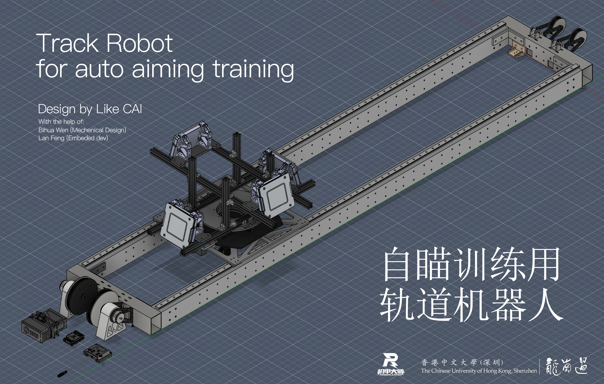
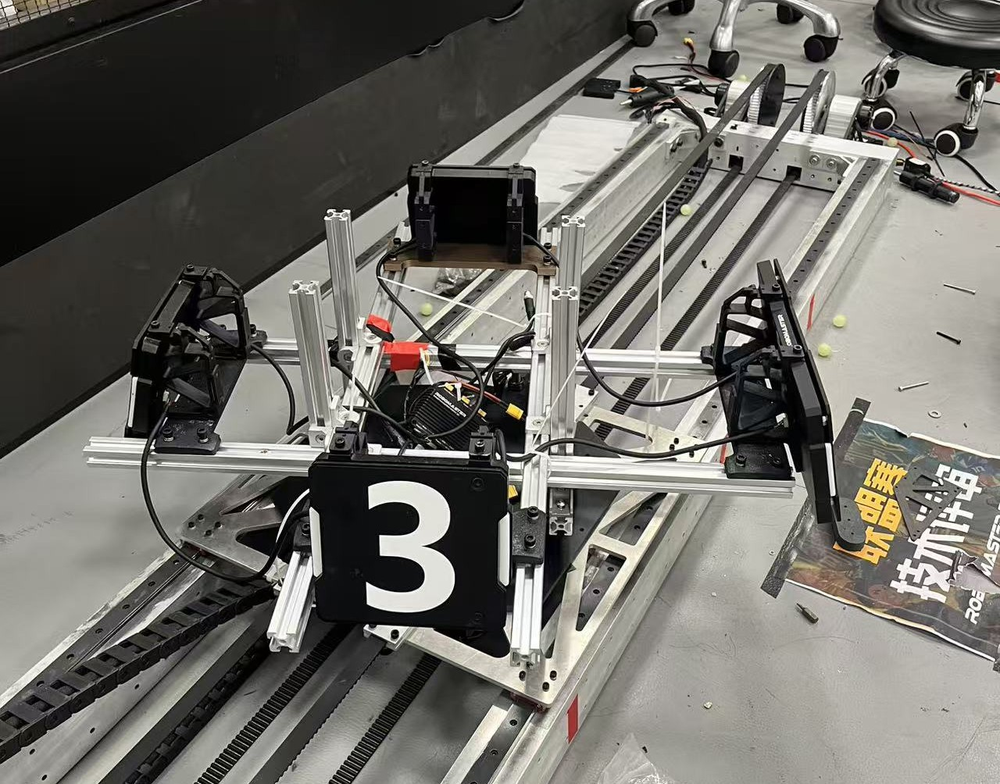

中文为默认文档，英文版见 [English README](./README.en.md)

## 目录

- [机械设计说明](#机械设计说明)
	- [旋转部分](#旋转部分)
	- [平动部分](#平动部分)
	- [BOM表](#bom表)
- [代码说明](#代码说明)
- [缺点与改进方向](#缺点与改进方向)
	- [设计阶段](#设计阶段)
	- [加工阶段](#加工阶段)
	- [装配阶段](#装配阶段)
	- [调试阶段](#调试阶段)

# 机械设计说明
## 系统概述

本机器人为轨道式训练平台，目标是模拟 RoboMaster 机器人四块装甲板在空间中的运动轨迹。  
在现实环境中实现指定的线速度与角速度，为视觉组提供真实可靠的自动跟随瞄准训练场景。  
  
整体结构分为两个独立的运动模块：旋转部分负责装甲板的自转，平动部分负责沿轨道的直线运动，其中旋转部分安装在平动部分上。

## 开源目的
一是纪念我在RM对内第一个大项目完工   
二是记录一些问题，供其他人参考  
在这里鸣谢Bihua Wen设计了轨道部分的开孔和连接方式，减轻了我的负担。  
Lan Feng修改了24步兵的代码，让我可以快速进行嵌入式的调试。 

## 仓库结构与快速开始

- 硬件/结构相关：`01-hardware/`
	- `移动部分总装.step`、`总装.step`、`总装.f3z`、`BOM.csv`
- 固件工程：`02-firmware/`
	- 工程与构建说明见 [02-firmware/README.md](./02-firmware/README.md)
	- 关键控制文件：[`Robo_Chassis.c`](./02-firmware/SEML/App/Robo/Robo_Chassis.c)
- 文档与图片：`03-docs/`
	- 概览图：`03-docs/Images/overview.png`

---

## 需求工程

### 设计目标

设计一个模拟 RoboMaster 机器人四块装甲板在空间中运动轨迹的轨道机器人，
1. 尽量贴近地面，使上部可调空间更大
2. 旋转部分尽量轻，电机齿比设置合理，保证安全的同时达到更高的旋转速度
3. 移动部分整体要轻，提高平动的灵敏度
4. 电池和控制部分脱离运动部分，提高安全性。
5. 成本控制

### 技术指标

| 参数 | 数值 | 备注 |
|------|------|------|
| 线速度范围 | 2m/s | 无法在安全的情况下测得 |
| 角速度范围 | 6rad/s | 无法在安全的情况下测得 |
| 装甲板数量 | 4 块 | 分布可调 |

实则是轨道太短，2m的轨道机器可以在1s内跑完，然后撞到边框。

### 3508性能参考
电机参数截图见：[3508电机数据](./03-docs/Images/3508电机数据.png) [出处](https://www.robomaster.com/zh-CN/products/components/general/M3508)

---

## 旋转部分

### 动力方案

动力来源：大疆 M3508 无刷直流减速电机 × 1
传动方式：转动是3508驱动，主动齿：被动齿 = 50:130

参考图纸：

- [加工-旋转主动齿-45#钢-v3.pdf](./03-docs/加工-旋转主动齿-45%23钢-v3.pdf)
- [加工-旋转从动齿-6061铝.pdf](./03-docs/加工-旋转从动齿-6061铝.pdf)

---

### 装甲板布局

装甲板采用铝型材框架固定，四块装甲板的间距与朝向可通过重新装配铝型材位置进行调整，
无需加工新零件，具备一定的布局灵活性，可模拟不同型号 RoboMaster 机器人的装甲板分布。

---

## 平动部分

### 动力方案

动力来源：大疆 M3508 无刷直流减速电机 × 2

### 传动设计
平动的动力齿轮一周是80齿。

参考图纸：

- [加工-平动动力轮-6061铝-v3.pdf](./03-docs/加工-平动动力轮-6061铝-v3.pdf)
- [移动部分总装.step](./01-hardware/移动部分总装.step)

采用 HTD 5M 型同步带传动。HTD 齿形具有较大的齿根高度，
接触面积大，在大载荷冲击下会发生跳齿，起到过载保护作用，避免损坏电机与结构件。

### 缓冲保护

两端安装油压缓冲器，机器人到达行程末端时除去电机控制减速外，机械上被动减速，保护机械结构免受冲击，增加可靠性。
选型：ACA 2025-1

| 参数 | 数值 |
|------|------|
| 油压缓冲器最大承受速度 | 4 m/s |
| 油压缓冲器最大有效重量 | 260 kg |
| 油压缓冲器最大吸收能量 | 65 Nm |

---

## BOM表
由于加工失误与试错,总价大约4000CNY
参考 [BOM](./01-hardware/BOM.csv)

# 代码说明
直接在24赛季步兵代码中进行修改，有许多冗余部分，唯一需要修改的部分是 [Robo_Chassis.c](./02-firmware/SEML/App/Robo/Robo_Chassis.c) 的控制文件

要注意由于电机是对称安放，两个电机设置相同的线速度时，方向要相反。

# 缺点与改进方向

## 设计阶段
### 双轨道方案成本偏高

当前采用双轨道设计，结构成本较高。理论上的改进方向是改为单轨道 + 摩擦轮方案。
但设计阶段考量了实际使用场地的条件——摩擦轮方案对地面平整度要求较高，
场地不满足条件时运动稳定性无法保证，因此暂时保留双轨道方案。

### 同步轮配套夹板没有预留涨紧套维护孔
使用涨紧套对电机和同步轮进行紧固，但是同步轮的盖板覆盖了轴心整个区域，导致当需要上紧涨紧套的时候，需要卸掉盖板

### 同步轮没有预留公差
同步轮的厚度和5M同步带宽度一样，导致阻力过大，可以通过稍微拧松盖板解决。
后期通过3D打印增厚片完美解决。

### 明确设计目标
我在设计时花费很多时间但是没有产出的实验是
1. 打算做出一个通用的旋转模组构型，实现一个机构完成靶车和前哨站的搭建
2. 测试自制12路导电滑环，电刷和3D打印结构都验证了，但是后期由于没有需求后搁置 

### 质疑不合理的需求
2m长的轨道注定线速度跑不快，但是更长的轨道是否能用同步带，同步带是否能张紧？都需要考虑。

## 加工阶段
### 旋转齿轮加工成本过高

这是本人首次设计与加工，经验不足，旋转云台的大齿轮采用了慢走丝工艺加工，
单件成本接近 1000 元。后续版本应优先考虑替代加工工艺以降低成本。

## 装配阶段
### 拉铆螺母导致零件贴合不平整
使用拉铆螺母固定时，零件之间的贴合面存在不平整问题。
后期改用打印件内嵌件后有所改善。
理想方案是 CNC 攻螺纹内嵌件，贴合精度最好，但会进一步提高加工成本。
### 导轨拼接精度不足，限制了平动行程

由于没有千分表等精密测量工具，导轨拼接安装难度过高。
实测两段 10 cm 导轨拼接后，滑块经过拼接处时有明显震动，
因此放弃了拼接方案，转为使用整根导轨。
受快递运输限制，单根导轨最长为 2 m，当前平动行程受此约束。
如何在不依赖拼接的前提下延长平动区间，是后续版本需要重点解决的问题。

## 调试阶段
### 3508电机突然换向，多次后会触发保护
单次测试过长时间，反复换向多次后会发现换向的速度明显变慢，不如刚开始敏捷。可能是触发电机保护。
改进方向，在非必要的时刻使用温和的换向方式“缓停缓启”

# 免责声明
本项目仅供学习与研究使用，作者不对因使用本项目造成的任何硬件损坏、
人身伤害或其他损失承担责任。使用前请确保操作安全，遵守相关法律法规。

本项目与大疆创新（DJI）及 Robomaster 官方无任何关联。

本开源仅作为参考，不适合直接发加工装配

